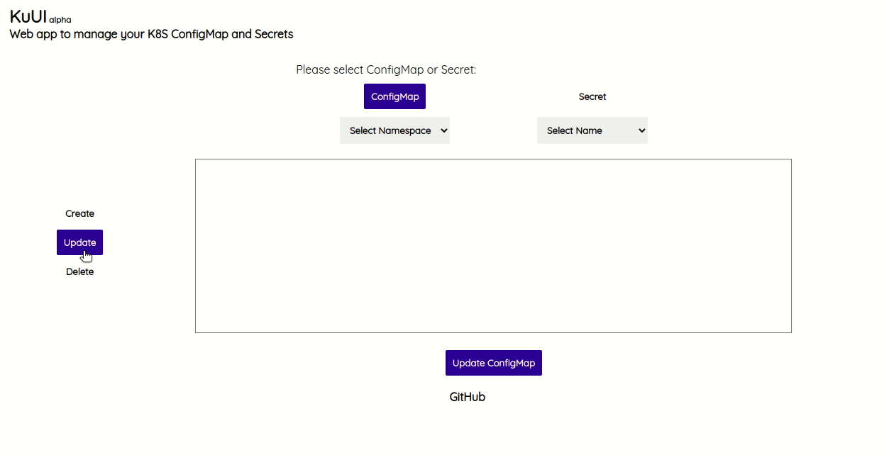

# KuUI (Kubernetes UI)
The main purpose of this application is to have a simple UI that can be used to manage the configmaps/secrets of your Kubernetes cluster.

# Installation

To use this project either you can build it from source or download the binaries.

## Build it from source

To build the project from source, please clone it on your machine using below command

```
git clone https://github.com/viveksinghggits/kuui.git
```

and you can build the project using the command `go build -o kuui`. Optionally you can move the created binary
into your path so that you can use this from where ever you want.

### Running it

To run the project you just have to execute the `kuui` binary by providing it the kubeconfig file. Like below
```
./kuui --kubeconfig=$HOME/.kube/config
# or whereever you kubeconfig file is
```

To access the UI you will just have to open the index.html file in your favourite web browser  and you will be asked to enter the endpoint of backend service for the first time. After that you can
just acccess the web UI without any issues.




## RoadMap

* Get the service deployed on Kubernetes

**Note**
I recently started working on this and would love to hear your inputs/feedback, please feel free to raise an issue
or open a PR.